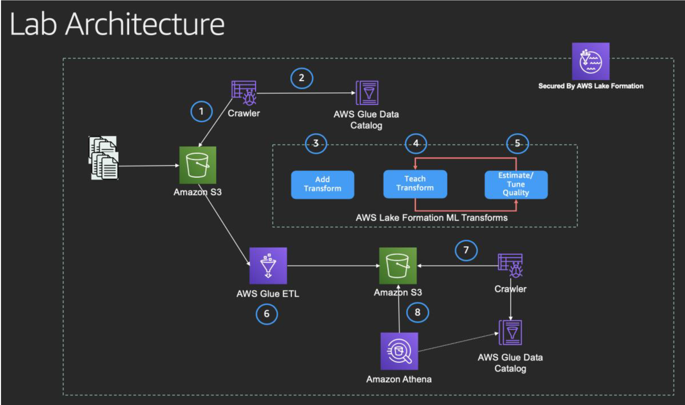

## Workshop - Using AWS Lake Formation ML Transforms to cleanse the data in a data lake

### Background
Customers ingest data from multiple sources into their data lakes. This data often has the same meaning but uses different labels/names, which can take months to cleanse, slowing down the data processing and analytics cycle.

### Introduction
In this lab, participants will go through various steps to provision a data lake, catalog data in AWS Glue Data Catalog and use AWS Lake Formation ML Transforms to cleanse the data in a data lake.

### Lab Data Set
We have used the synthetic dataset generated from Open Source Freely extensible Biomedical Record Linkage Program (FEBRL). This dataset mimicks real-life patient data sets that lead to duplicates. You can also generate the dataset by following the steps mentioned @ https://github.com/J535D165/FEBRL-fork-v0.4.2/tree/master/dsgen. For the sake of simplicity, we would be copying the dataset automatically into an Amazon S3 bucket that is created as part of the CloudFormation launch.

### Architecture
Below is the high-level architecture that you would be implementing as part of this lab.

### Activities
Below table summarizes various activities to be done as part of creating a data lake and using AWS Lake Formation ML Transforms to deduplicate the data in a data lake.

| No. | Activity  | User |
| --- | ------------- | ------------- |
| 1 | Provision the following:  - Data lake on Amazon S3  - Data lake administrator  - Data lake analyst/developer  - Data lake and glue roles   | IAM Administrator  |
| 2| Register a data lake  | Data Lake Administrator  |
| 3 | Assign Lake Formation Permissions to data lake analyst | Data Lake Administrator |
| 4 | Create AWS Glue Database | Data Lake Administrator |
| 5 | Crawl and catalog Patient data in AWS Glue | Data Lake Analyst |
| 6 | Login back as data lake administrators and assign table permissions to data analyst | Data Lake Administrator |
| 7 | Observe the data pattern and duplicates in data using Amazon Athena | Data Lake Analyst |
| 8 | Create, teach and Tune an AWS Lake Formation ML Transform | Data Lake Analyst |
| 9 | Create an AWS Glue ETL Job to use ML Transform for data deduplication | Data Lake Analyst |
| 10 | Catalog de-duplicated data and query using Amazon Athena | Data Lake Analyst |

## Workshop Activities

1. [Provision a data lake, data lake administrator and data lake analyst](lab-guides/activity1.md)
2. [Register a data lake](lab-guides/activity2.md)
3. [Assign Lake Formation Permissions to data lake analyst and service role](lab-guides/activity3.md)
4. [Create AWS Glue Database](lab-guides/activity4.md)
5. [Crawl and catalog Patient data in AWS Glue](lab-guides/activity5.md)
6. [Login as Data Lake Administrator and assign Table permissions](lab-guides/activity6.md)
7. [Observe the data pattern and duplicates in data](lab-guides/activity7.md)
8. [Create, teach and Tune an AWS Lake Formation ML Transform](lab-guides/activity8.md)
9. [Create and Run Glue ETL Job to use ML Transform for finding duplicates](lab-guides/activity9.md)
10. [Catalog de-duplicated data and query using Amazon Athena](lab-guides/activity10.md)

## License

This library is licensed under the MIT-0 License. See the LICENSE file.

