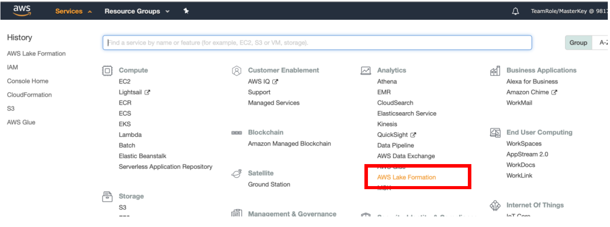
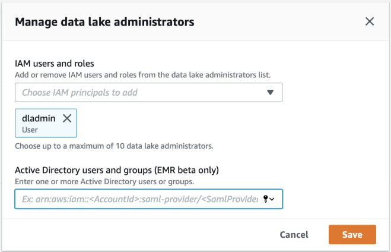
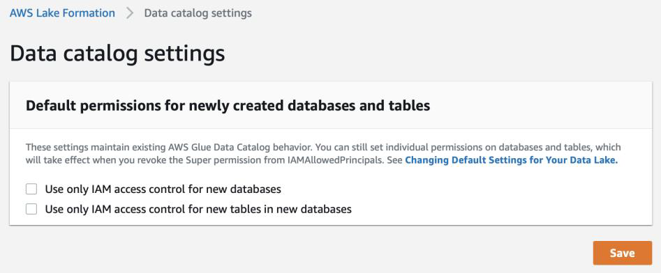

[Back to main guide](../README.md) | [Next](activity2.md)

____

## 1. Provision a data lake, data lake administrator and data lake analyst

### a. Launch CloudFormation Template

### b. Setup Data Lake Administrator
Navigate to Lake Formation Dashboard from AWS Management Console.

First time you navigate to Lake Formation Dashboard page, you would be prompted for creating a Data Lake Administrator. Click on **“Add administrators”**.

OR

i) While you are logged in as an IAM Admin user

ii) Go to => Lake Formation Console **→ Admins and database creators → Data lake administrators → Grant**

iii) Click on **Add Administrators**

iv) Select the Data Lake Administrator as **“dladmin”** user and click on **Save**.

v) Another recommended change that you would need to do is to go to Lake Formation Console **→ Data Catalog → Settings** and **uncheck** both the boxes as shown below and click on **Save** button.

After this step you, would not be using this IAM user again. Instead you will use **dladmin** user as a Data Lake Administrator and **dlanalyst** user as a data lake analyst/developer.

___

[Back to main guide](../README.md) | [Next](activity2.md)
