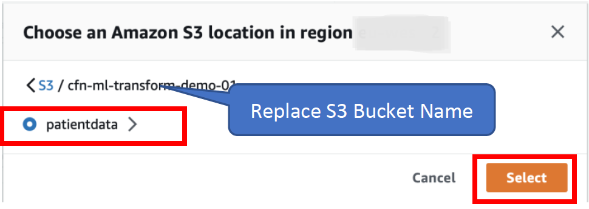
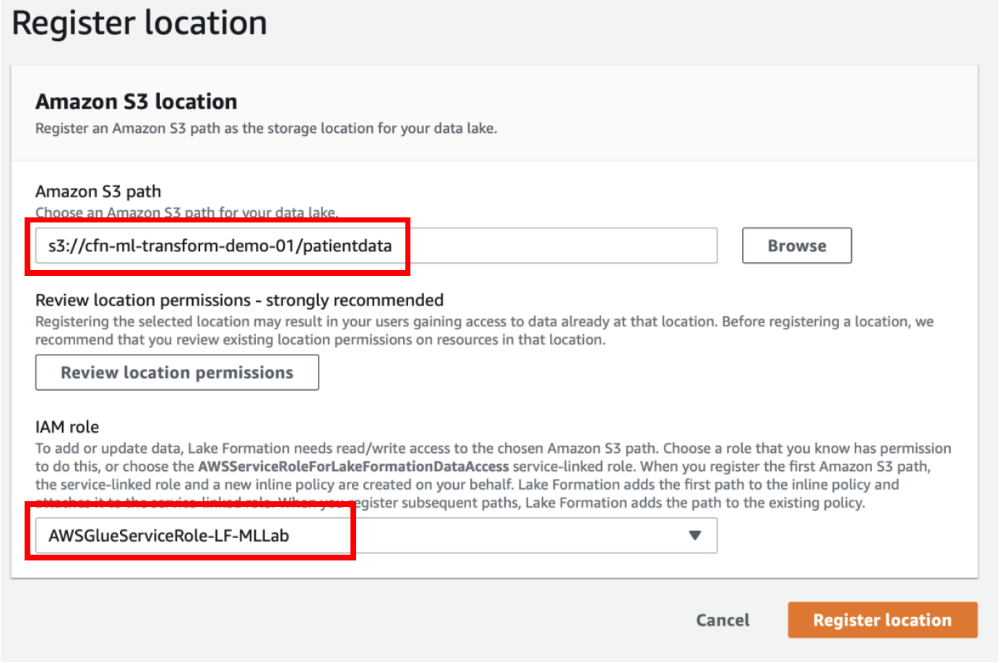

[Back to main guide](../README.md) | [Next](activity3.md)
___

## 2. Register a data lake

Data Lake Administrators would register the data lake, so that, when you point Lake Formation at your data sources, Lake Formation can crawl those sources and would be able to access the data into your new Amazon Simple Storage Service (Amazon S3) data lake.

a) Login as a data lake administrator **dladmin**

b) To register a data lake location, Navigate to Lake Formation Console **→ Under Register and Ingest on the left side → Data Lake locations** → Click on **Register Location.** 

c) Select the **S3 bucket name** created for you and **patientdata** folder under it

d) For IAM Role, select the role AWSGlueServiceRole-LF-MLLab

e) Click on **Register Location**. You would see the confirmation that S3 path is registered successfully.

___

[Back to main guide](../README.md) | [Next](activity3.md)
