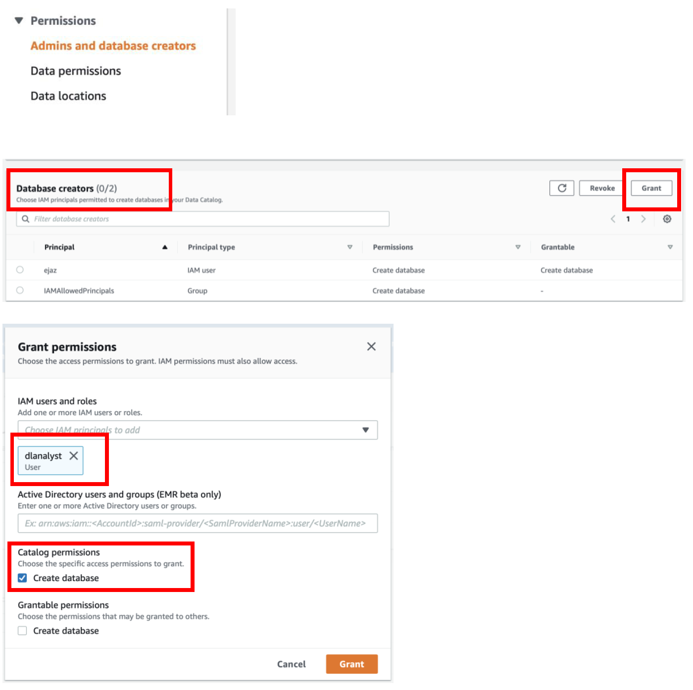

[Back to main guide](../README.md) | [Next](activity4.md)
___

## 3. Assign Lake Formation Permissions to data lake analyst and service role

### a) Grant database creation permission to data analyst

Data lake administrator has to give the privileges to IAM Principal such as a User or Role in order to be able to perform CRUD operations on objects (database/tables) in data catalog.

i) Login as a Data Lake Administrator – dladmin

ii) From Lake Formation console, navigate to **Admins and database creators** under Permissions section in Lake Formation console **→ under Database Creators section Click on Grant 
→ Select user dlanalyst** and check the **Create database option** under Catalog permissions.

iii) Click on **Grant** to save the Create database permission for the **dlanalyst**

### b) Grant Data Location Permission to data analyst and AWS IAM Service Role

You will also need to grant the permission to dlanalyst on the data lake storage.

i) In Lake Formation console, navigate to **Permissions → Data locations** → Click on **Grant**

ii) Select the dlanalyst as well as AWS Service Role **‘AWSGlueServiceRole-LF-MLLab’** from **IAM users and roles** dropdown

iii) In the Storage location field select **‘\<<s3bucket\>>/patientdata’**

iv) Click on **Grant** to save the changes

___

[Back to main guide](../README.md) | [Next](activity4.md)

