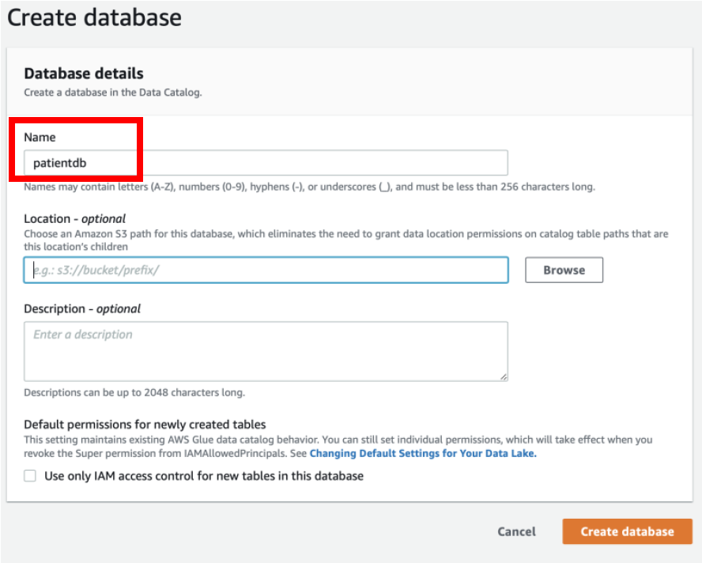
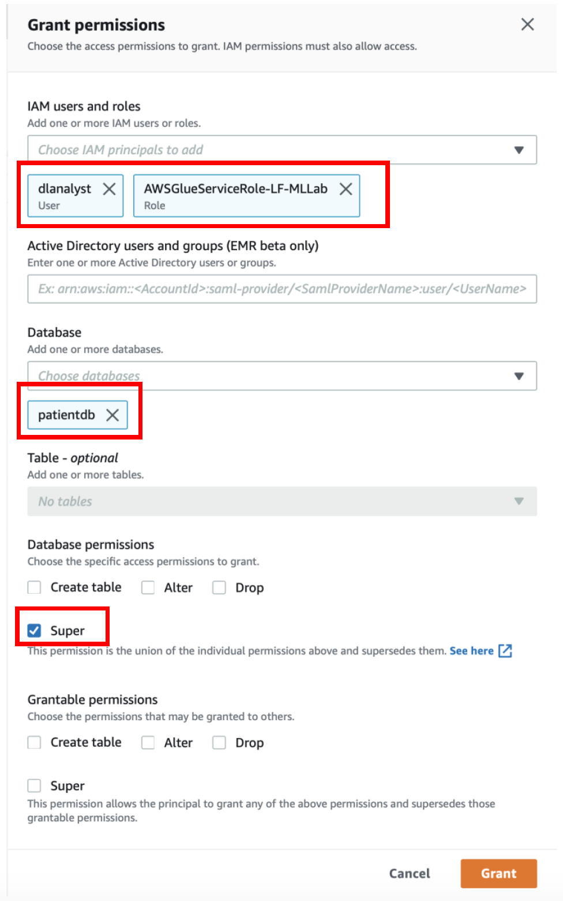

[Back to main guide](../README.md) | [Next](activity5.md)
___

## 4. Create AWS Glue Database
AWS Glue Database is a collection of Tables in Glue data catalog. While **logged in as Data Lake Administrator (dladmin)**, let us create the database and add permissions for **dlanalyst** and **Service Role** on this database.

a) Navigate to Lake Formation Console → **Data Catalog section → Databases → Create database**

b) Give **Name** as **patientdb**

c) Click on **Create Database**

d) Navigate to **Permissions → Data Permissions → Grant**

e) Select User **dlanalyst** as well as service role **‘AWSGlueServiceRole-LF-MLLab’**

f) Select **database** as **patientdb**

g) Under **Database permissions** select **Super**

h) Click on **Grant** to save the changes

___

[Back to main guide](../README.md) | [Next](activity5.md)

