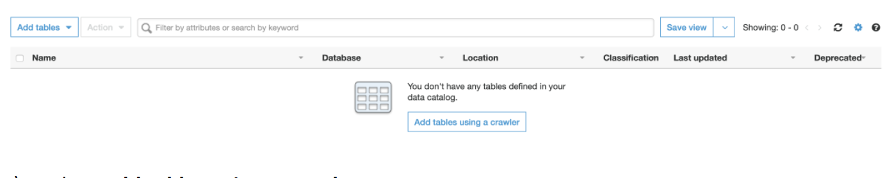
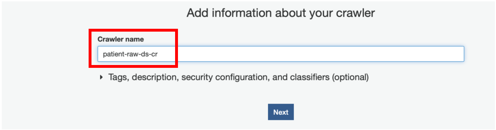
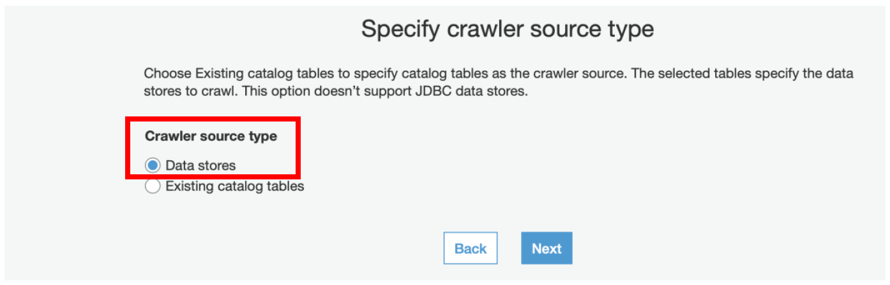
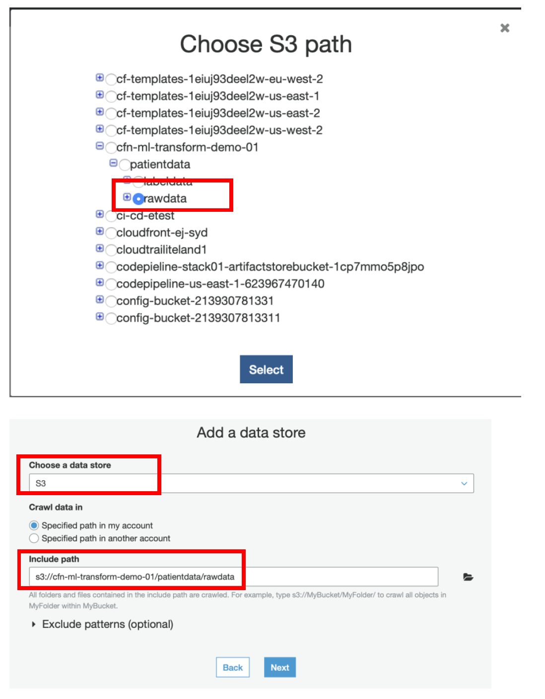
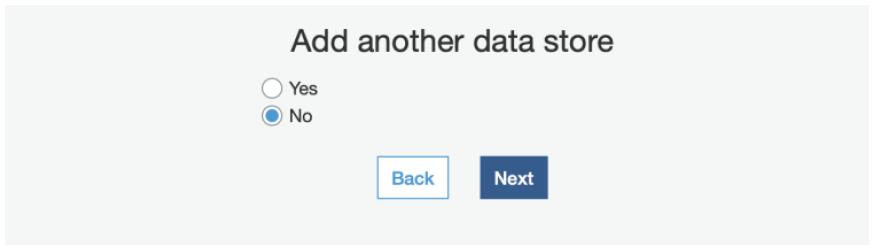
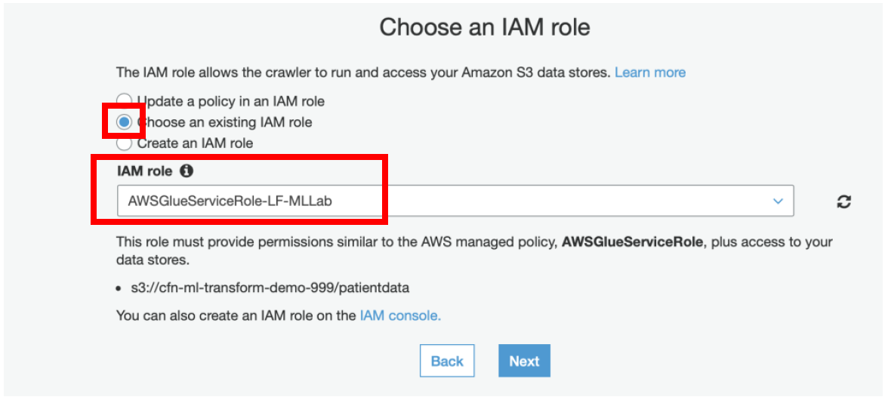
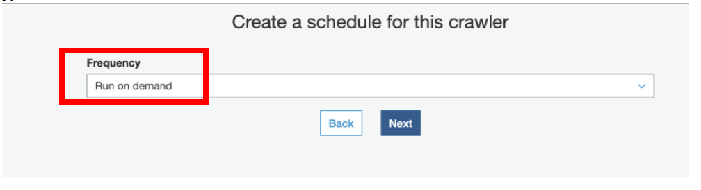
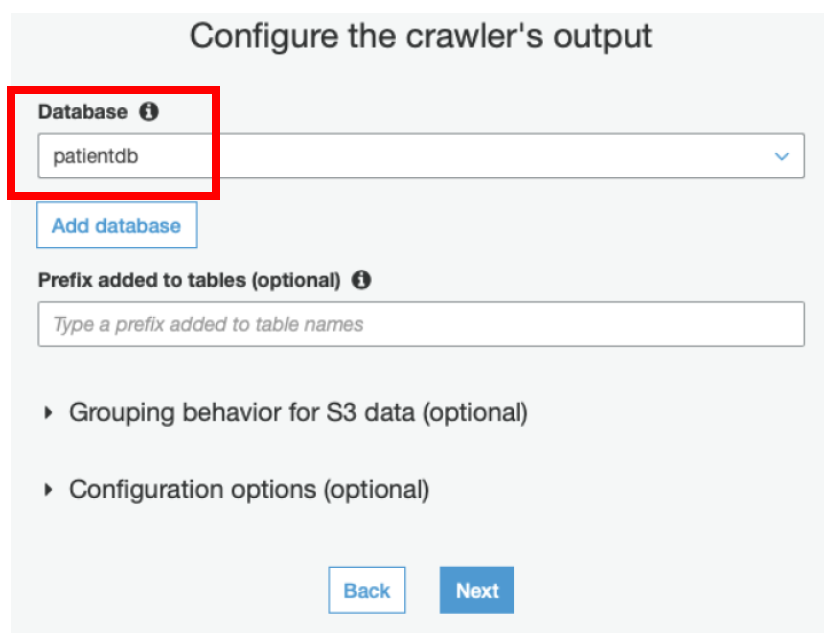
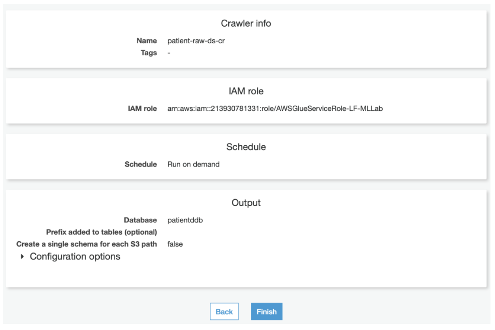
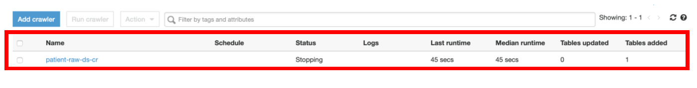

[Back to main guide](../README.md) | [Next](activity6.md)
___

## 5. Crawl and catalog Patient data in AWS Glue
FindMatches ML Transform that we would be using, operates on tables defined in the AWS Glue Data Catalog. Use AWS Glue crawlers to discover and catalog the patient data.

a) Login as **dlanalyst**

b) Navigate to Lake Formation Console **→ Data Catalog → Tables → Create Table using a crawler**

Click on **Get Started** in case you are prompted.

c) Select **Add tables using a crawler**

d) Give Crawler name as **patient-raw-ds-cr** and click **Next**

  
e) Select Data stores on the next page

f) Select **S3** in **Choose Data Store** dropdown

g) Select **\<S3Bucket\>/patientdata/rawdata** as Include path

h) Click **Next**

i) Select **Choose an existing IAM role** and select **AWSGlueServiceRole-LF-MLLab**

j) Click **Next**

k) Select **Database** as **patientdb** and click **Next**

l) Click **Finish** button, select the crawler and click **Run Crawler**

Once the crawler is run successfully, it would create the table under AWS Glue Data Catalog Database. As a next step, Data Lake User would want to query the data in a data lake through data catalog tables. In order to do this, they would need permission from Lake Formation. In the next step, we login as a Data Lake Administrator and give ‘dlanalyst’ the permission to Select, Insert, Update, Delete data from a table in AWS Glue Data Catalog.

___

[Back to main guide](../README.md) | [Next](activity6.md)

