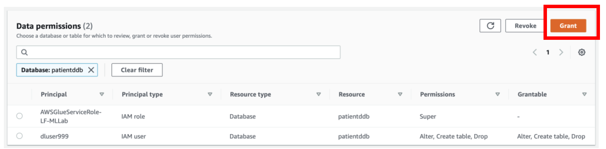
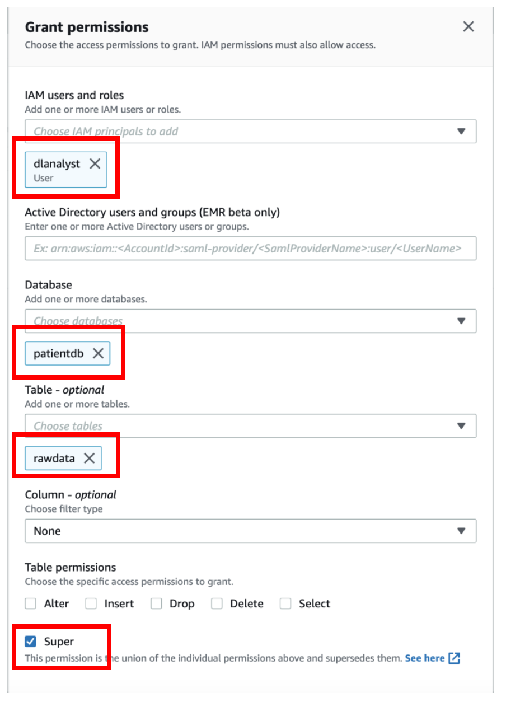

[Back to main guide](../README.md) | [Next](activity7.md)
___

## 6. Login as Data Lake Administrator and assign Table permissions

a) Login as data lake administrator user **dladmin**

b) From Lake Formation Console, navigate to **Permissions → Data Permissions → Grant**

c) Select user **dlanalyst**

d) Under **Database** section, select **patientdb**

e) Under **Table** section, select **rawdata**

f) Under **Table permissions** section, select **Super**

g) Click on **Grant** to save the changes

___

[Back to main guide](../README.md) | [Next](activity7.md)

