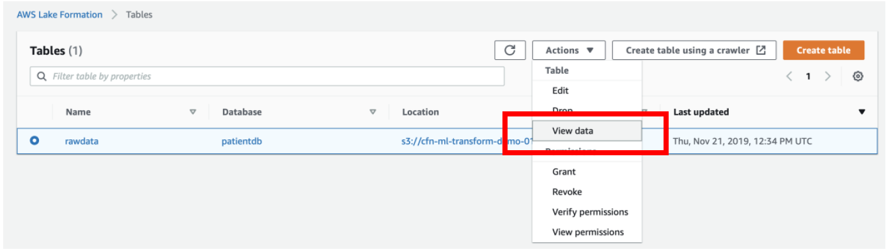
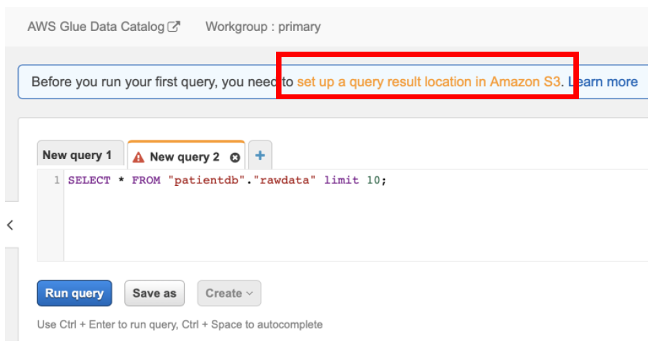
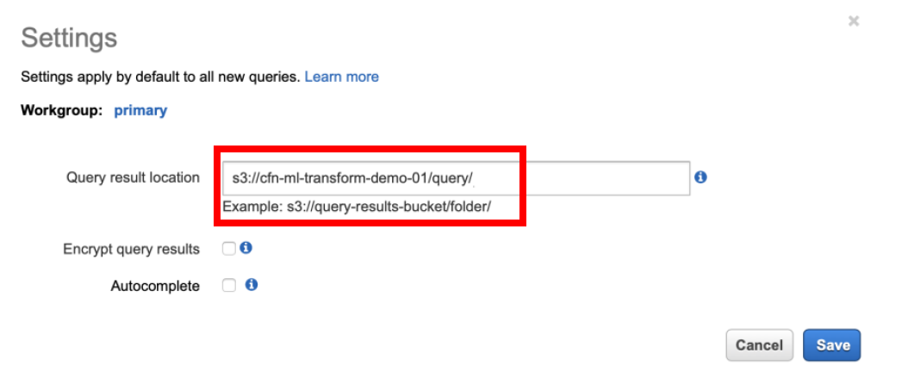
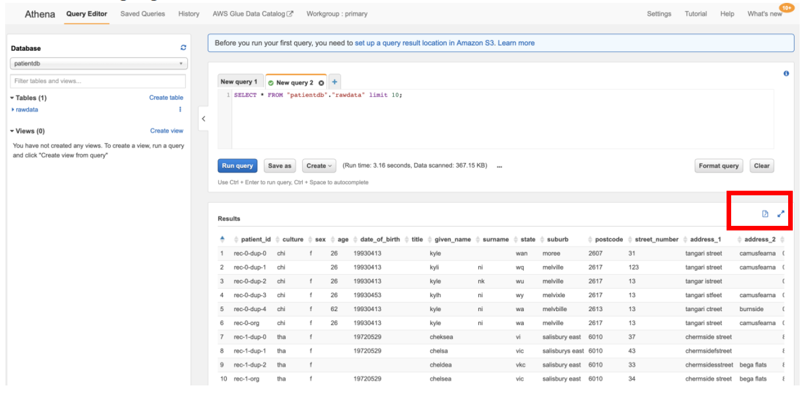
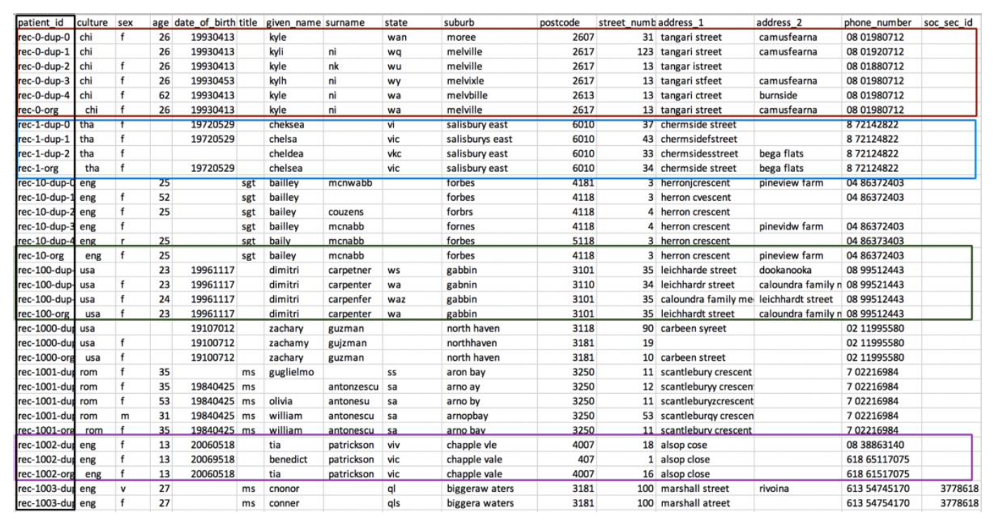

[Back to main guide](../README.md) | [Next](activity8.md)
___

## 7. Observe the data pattern and duplicates in data

You can now query data in Data Lake using Amazon Athena. Perform the below steps:

a) Login as **dlanalyst** if not already

b) Navigate to **Lake Formation Console → Data Catalog → Tables**

c) Select the **rawdata** table → **Actions → View data**

d) In the **Athena console** → select database as **patientdb → tables rawdata → options Preview**

e) You can download the csv by removing the **limit** clause in the select statement and clicking on the **Download the results** icon in the Results section

NOTE:
After landing on Athena console, if you get an error or query doesn’t run, click on the **Set up a query result location in Amazon S3** link and enter the value as **s3://\<\<S3BucketName\>\>/query/**

**Note the trailing slash in the above path!**

f) Click on **Save** and run the query. You can download entire dataset by removing the **“limit 10”** clause from the SQL, running the query again and by clicking on the **download** icon as highlighted below.

g) Open the downloaded file in excel, sort by patient_id and observe the duplicates

As highlighted with different colors in the above table with identifying different groups that includes the original patient record grouped with its duplicates. The patient_id values are generated in a specific format that helps us identify the such groups. The format is “rec-\<record number\>-org/dup-\<duplicate record number\>” followed by FEBRL data gen tool.
As a next step, we will create, teach and tune AWS Lake Formation FindMatches ML Transform and then use it in the Glue ETL job to find matches and/or remove the duplicates.

___

[Back to main guide](../README.md) | [Next](activity8.md)
