[Back to main guide](../README.md) | [Next](activity9.md)
___

## 8. Create, teach and Tune an AWS Lake Formation ML Transform

### a) Create FindMatches ML Transform

i) Login as **dlanalyst**

ii) Navigate to AWS Glue Console → On the left side, under **ETL → Jobs → ML Transforms**

iii) Click on **Add Transform**

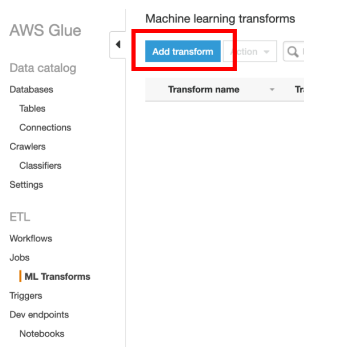

iv) Specify **patient-data-ml-transform** as **Transform name**

v) IAM Role as **AWSGlueServiceRole-LF-MLLab**

vi) Expand **Task Run Properties** section

vii) Select Worker Type as **G.1X (Recommended)** 

viii) Enter **Number of Workers** as **5** 

ix) **Glue Version** as **Spark 2.2 (Glue Version 0.9)**

x) Keep other values as default and click on **Next**

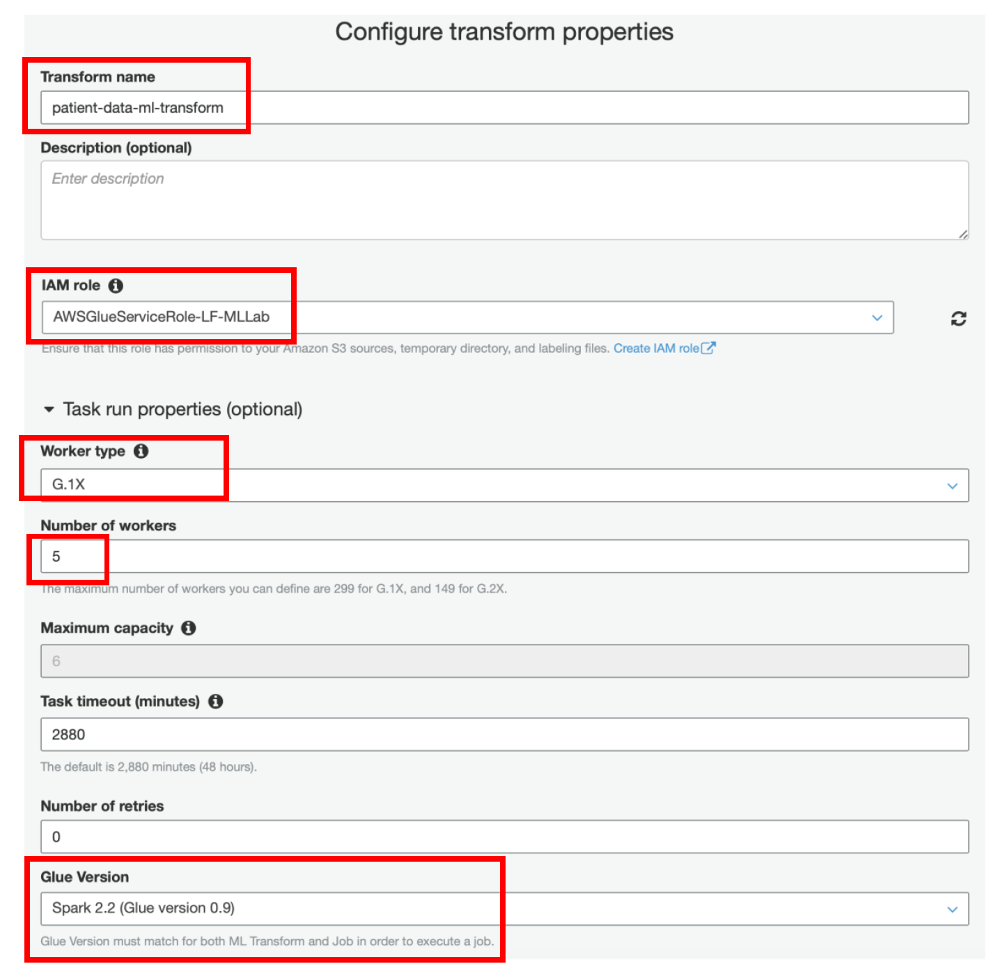

xi) Select **rawdata** as a **Data Source** and click **Next**

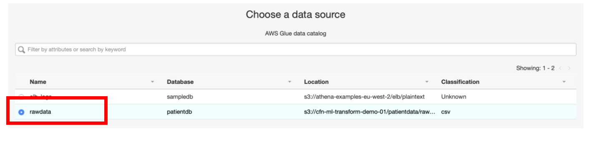

xii) Select **patient_id** as a **primary key** in the next page

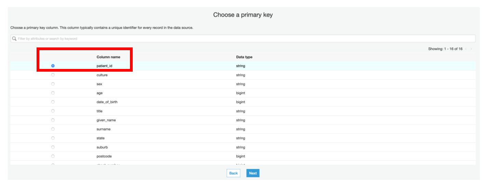

xiii) In the **Tune Transform** step, select **Custom** for **Recall vs Precision** and specify the value of **0.9**

xiv) Also, for **Lower cost vs Accuracy** select the **Custom** field and specify its value as **1**

We have specified these values to achieve the best results. If needed, you can later tweak these values by selecting the transform and using the Tune menu.

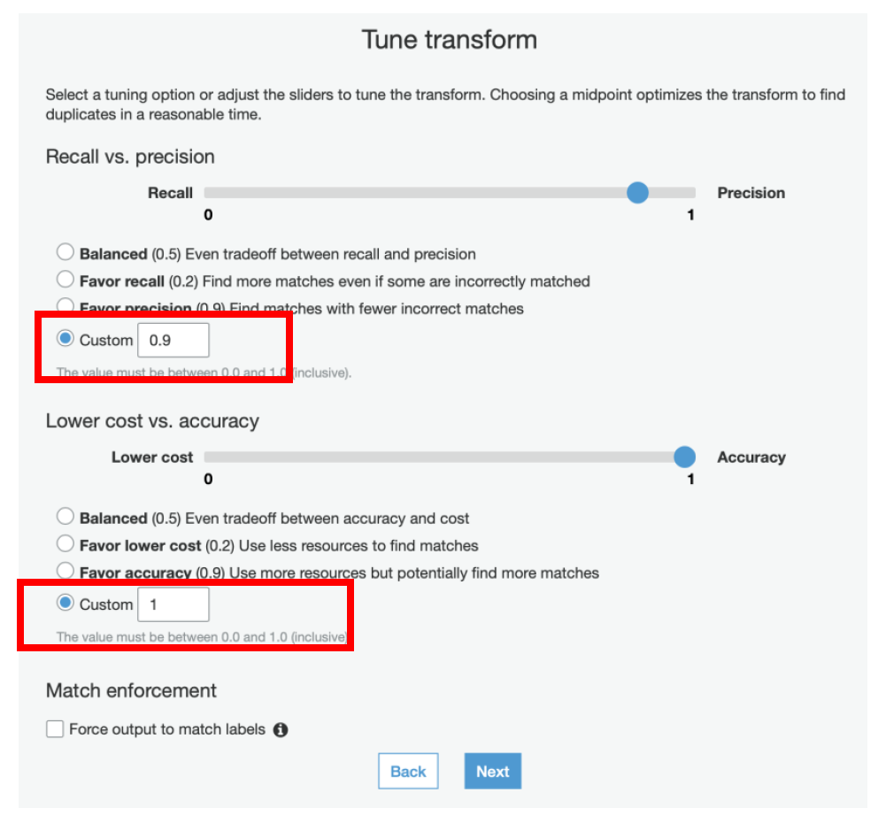

xv) Review the values and click **Finish**

### b) Teach transform to identify the duplicates
In this step we will teach the transform by providing labelled examples of matching and non-matching records. 
You can create your labeling set yourself or allowing AWS Glue to generate the labeling set based on heuristics.
AWS Glue extracts records from your source data and suggests potential matching records. The file will container approximately 100 data samples for you to work with. We highly recommend using the “Generate the Labeling file” feature to create the training set to teach your Transform.

i) Select **patient-data-ml-transform** Transform

ii) Select **Action → Teach transform**

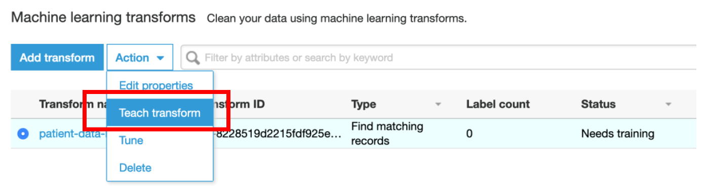

iii) Select **I do not have labels** and click on **Generate labeling file**

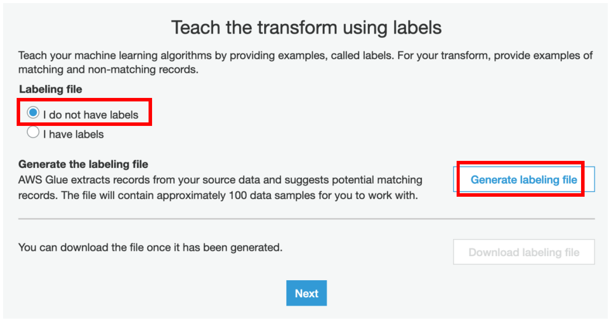

iv) Select the S3 location until labeldata folder and append **“/download”** to it, this is where you want to keep the generated labeling file and click **Generate**

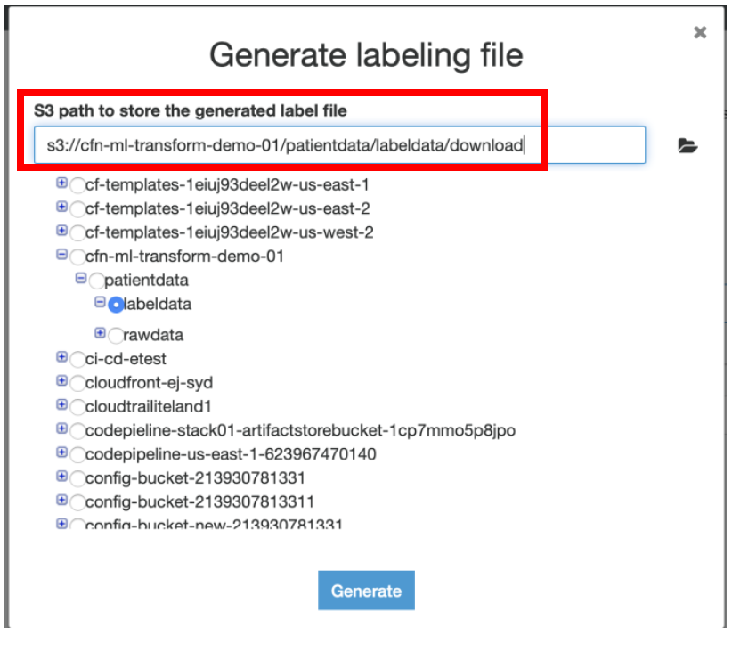

v) It would take approximately 10 mins for AWS Glue to generate the labeling file. Once enabled click on **Download labeling file.**

**NOTE: Instead of waiting at this point, you can proceed with step c) below of Uploading the label file from S3. This will save time.**
In case you want to take a look at the similar labelling file that gets generated, navigate to Amazon S3 Console → <<S3Bucket>>/patientdata/labeldata/ and download the “labeled-dataset-200.csv” file.

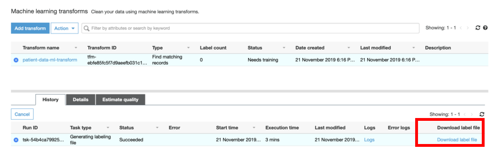

The labelled data file that is generated has the **label column empty** as shown below:

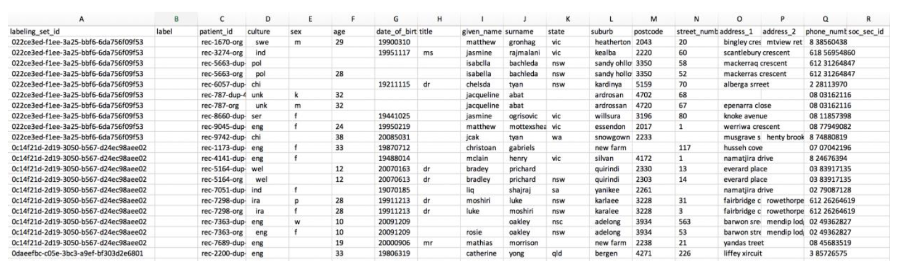

Notice that there are 2 additional columns added, **labelling_set_id** and **label_id**.

You will need to populate the label column explicitly by marking the records that are a real match with the same value. Each labelling set should contain positive and negative match examples.

This file is fully ready for consumption. However, let’s go a little deeper into its structure, so that you know how to prepare and label data for your matching projects. The label column is empty in the generated file and you need to fill this in like below:

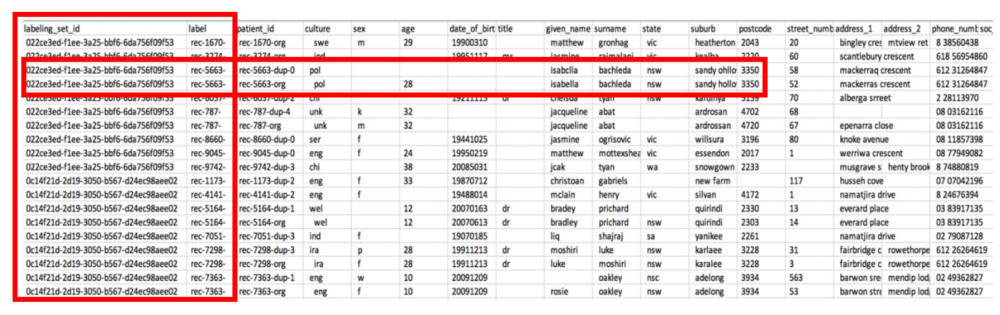

The entire training dataset is divided into labeling sets. Each labeling set displays a labeling_set_id value. This identification simplifies the labeling process, enabling you to focus on the match relationship of records within the same labeling set, rather than having to scan the entire file. **You would assign labels according to which records should match based on the attribute values.**

**If you specify the same label value for two or more records within a labeling set, you teach FindMatches to consider these records a match.** On the other hand, when two or more records have different labels within the same labeling set, FindMatches learns that these records aren’t considered a match. FindMatches evaluates record relationships only between records within the same labeling set, not across labeling sets.

Plan to label a few hundred records to achieve modest match quality. Plan to label a few thousand records to achieve high match quality.

For your convenience we have already created a sample labeling file under the S3 bucket specified while launching the Cloud Formation.

### c) Upload your labels and review match quality

After you create the labeled dataset, teach FindMatches where to find it.

i) In the **AWS Glue console**, select the transform that you created earlier.

ii) Choose **Action → Teach transform** 

iii) On the following page, select **I have labels**, choose **Upload labeling file from S3**, and then choose **Next**.

iv) On the **Estimate quality metrics** page, click on **Estimate transform quality** and **Finish**

v) You can go back to the **Glue Console -> Select the ML Transform → Under History tab, monitor the status of Estimate Transform Quality task**

vi) **Match Quality** operation may take some time to complete. Once the status is **Succeeded**, click on the **Estimate Quality** tab. You should see the results for transforms quality as shown below.

**NOTE: Instead of waiting on this step, you can read the instructions below and proceed to Step#9. Later, come back and verify the results for Estimate Quality operation.**

The transform quality estimate learns using 70% of your labels. After it’s trained, the quality estimate tests how well the transform learned to identify matching records against the remaining 30%. Finally, the transform generates quality metrics by comparing the matches and non-matches predicted by the algorithm vs. your actual labels. This process may take several minutes.

Your result should look like those in the above screenshot. Consider these metrics approximate, as the test uses only a small subset of data for estimating quality. If you’re satisfied with the metrics, proceed with creating and running a record matching job. Or, to improve matching quality further, upload more labelled records.

___

## Next Step: ETL:

Next step is running the ETL Job to find duplicates in rawdata table from Glue Data Catalog.

In this lab, you have 2 options for this:

|   | Options | Considerations |
| --- | ------ | ------ |
| 1 | Using AWS Glue Console, Run Glue ETL Job as per [Activity#9](activity9.md) and continue through the excercise | * This needs initial start-up time (cold start) for underlying Spark cluster to spin-up   * Recommended for production deployments |
| 2 | Use AWS Glue Development Endpoints.   Follow **Appendix A** to run PySpark code from SageMaker Jupyter Notebook and then follow **Appendix B** to catalog and query the matched/deduplicated data | * No start-up time. Development Endpoint is already provisioned as part of lab and ETL Job execution can begin immediately.   * Iterative ETL development through various kernels available in SageMaker Notebook instance   Recommended for Glue ETL dev phase |

___

[Back to main guide](../README.md) | [Next](activity9.md)
