[Back to main guide](../README.md) | [Next](activity10.md)

___

## 9. Create and Run Glue ETL Job to use ML Transform for finding duplicates

After you create a FindMatches transform and verify that it has learned to identify matching records in your data, you’re ready to identify matches and can do data deduplication over your complete dataset.

a) Login as **dlanalyst**

b) In the **AWS Glue console**, in the left navigation pane, choose **Jobs, Add job**.

c) Under **Configure the job properties** → **Name** as **patient-data-dedup-job**

d) Select IAM Role as **AWSGlueServiceRole-LF-MLLab**

e) Select **Type** as **Spark** 

f) **Glue version** as **Spark 2.2, Python 2 (Glue version 0.9)**

g) Keep defaults for other values and click on **Next**

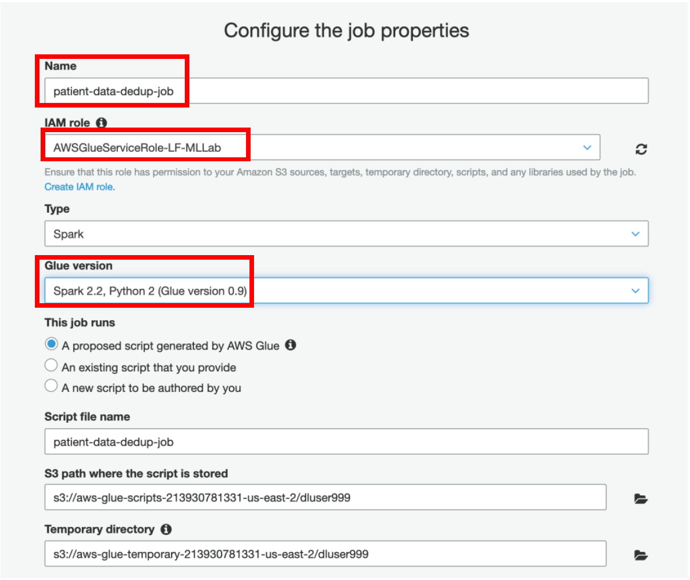

h) Select **rawdata** as a **data source**

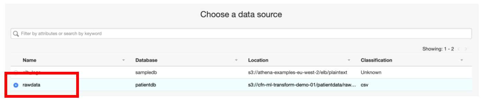

i) On the next page, select **Find Matching Records** and **check** the option **Remove Duplicate Records** 

j) Select **Worker Type** as **G.1X**

k) Specify **Number of workers** as **5**

l) Click **Next**

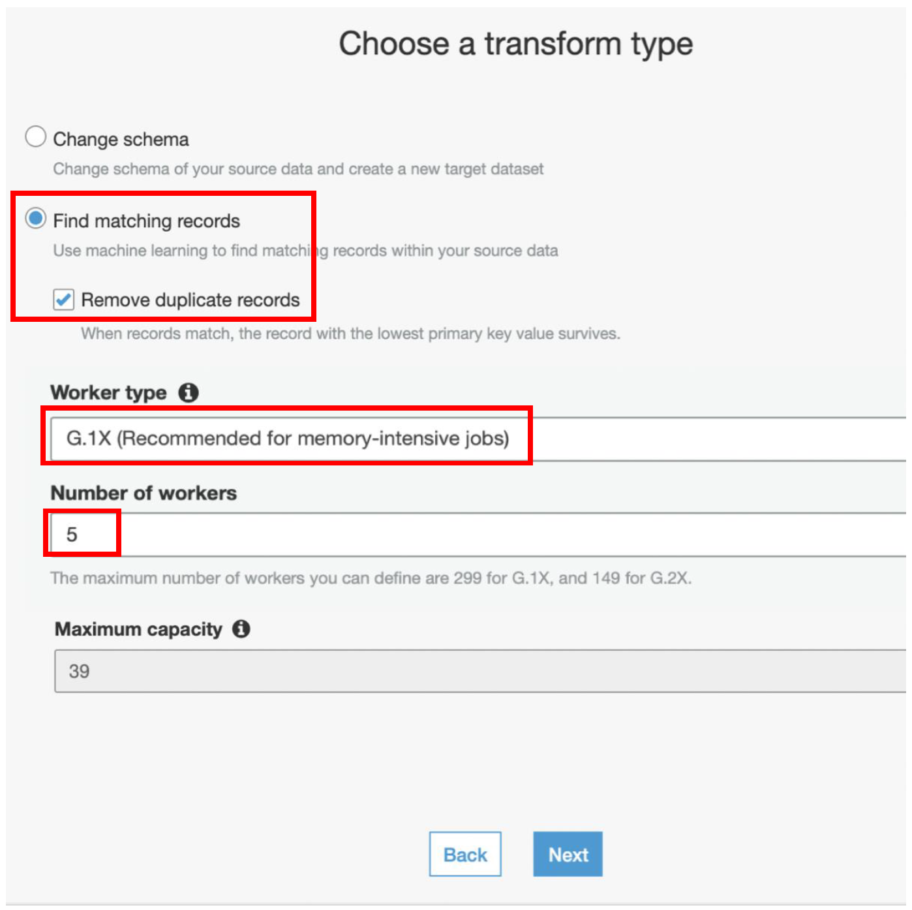

m) On the next page, select **patient-data-ml-transform** and click **Next**

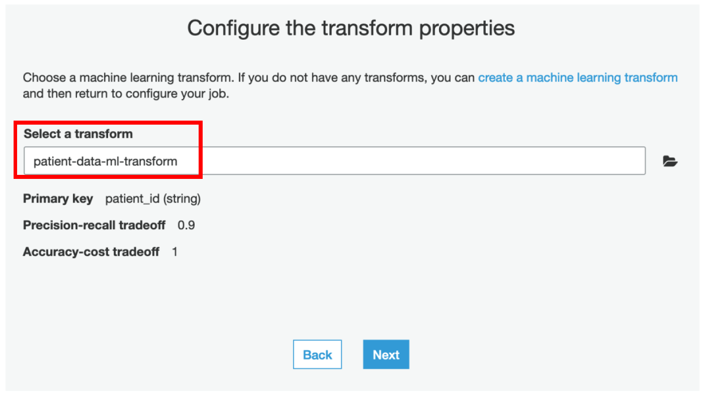

n) On the next page, select **Create tables in your data target**

o) Choose **Amazon S3** as a data store

p) Select Format as **CSV** 

q) Specify the Target path as **\<S3Bucket\>/patientdata/transformresult**

r) Click **Save job and edit script**

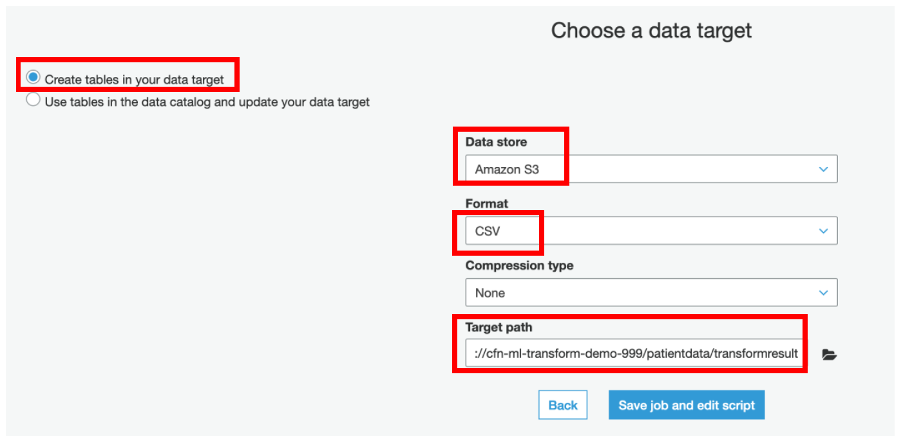

s) Click on **Run**, to run the Glue ETL Job which has auto-generated code which uses **FindMatches ML Transform** to identify the duplicate records and **removes** them.

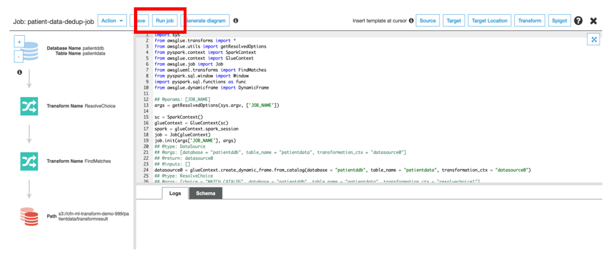

Below is the code snippet which uses FindMatches transform to identify the result.

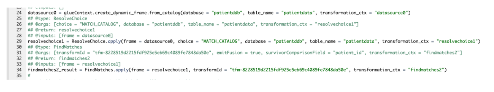

Below code removes the duplicate records and keeps the one with lowest primary key value. You may modify the logic to remove other records or even merge the records.

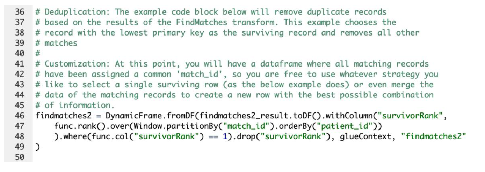

t) Click on **Run Job**

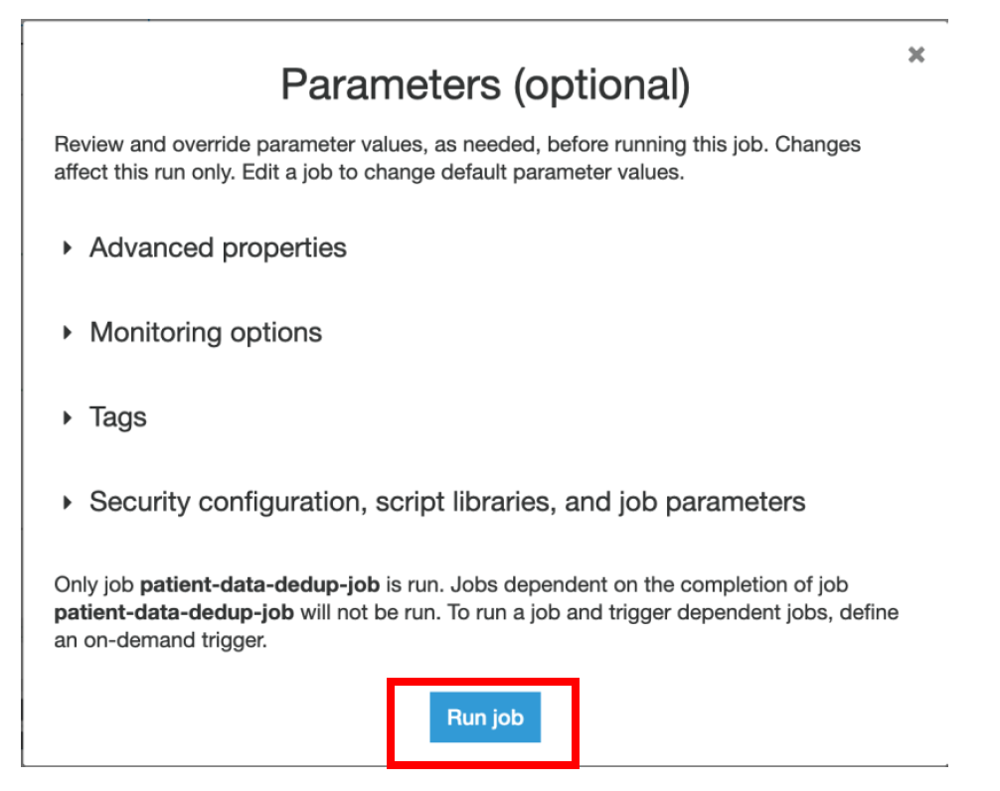

u) Monitor the progress of the Job from the Glue Console

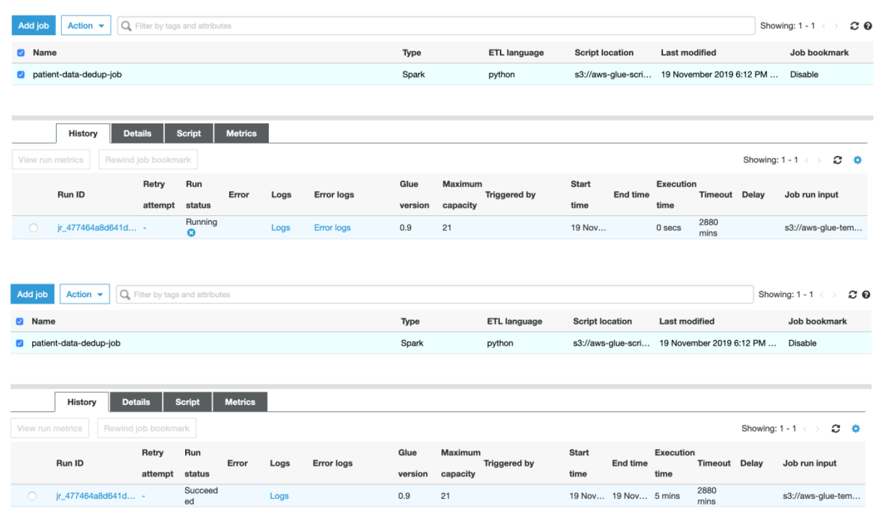

v) Once the Job status is **Succeeded**, you can verify the files under **transformresult** folder in S3 bucket

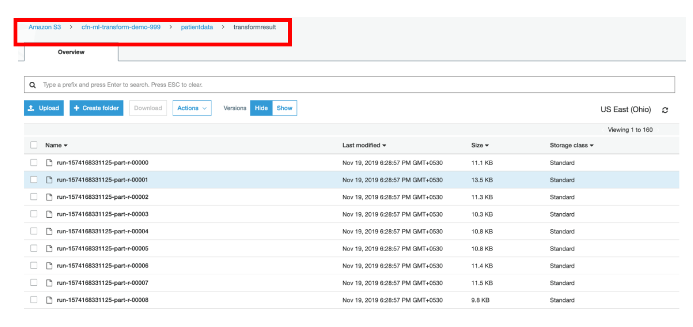

___

[Back to main guide](../README.md) | [Next](activity10.md)
