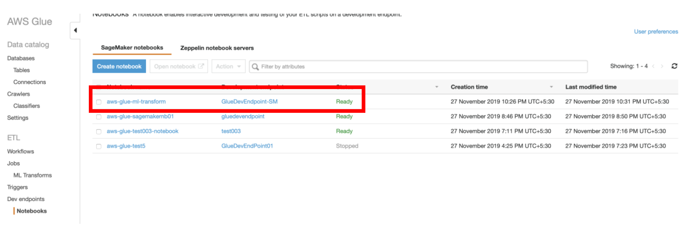
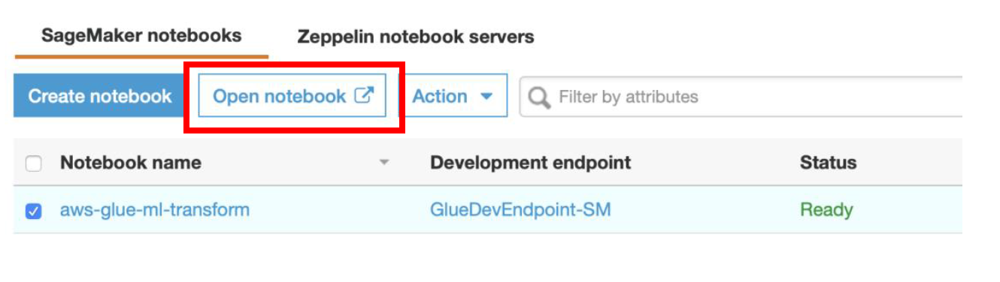
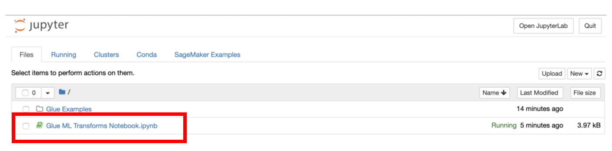
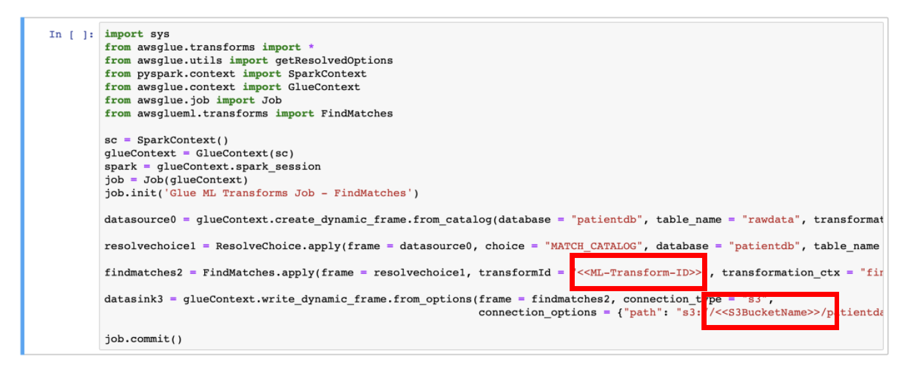
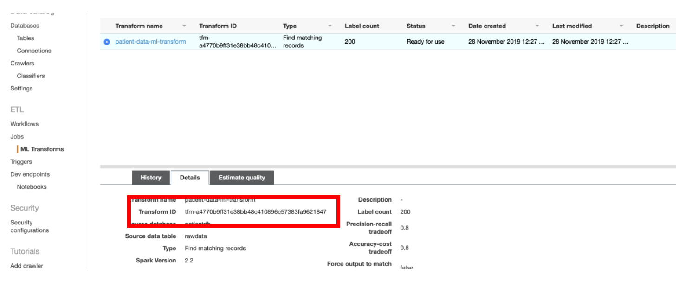
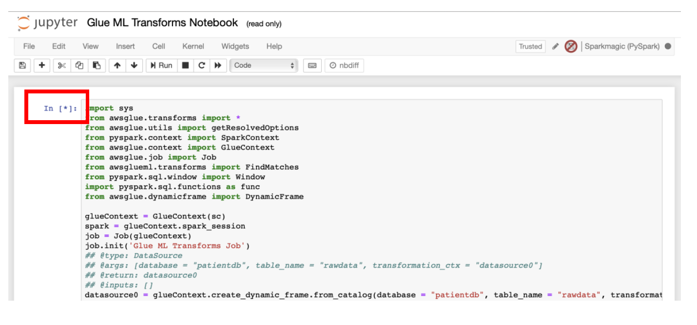
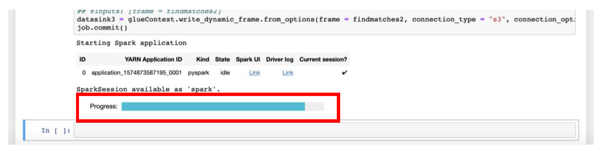

[Back to main guide](../README.md) | [Next](appendixB.md)
___

## Using Amazon SageMaker Jupyter Notebook to Run the Glue Job

### Step 1: Open Jupyter Notebook from AWS Glue Console

a) Navigate to AWS Glue Console,  **ETL → Dev Endpoints → Notebooks**

b) Select the notebook named **aws-glue-ml-transform** and click **Open notebook** button. This will take you to **SageMaker notebook** page.

### Step 2: Run the Glue PySpark script to deduplicate data using FindMatches ML Transform

a) In the **SageMaker Notebook** console, open the file named **“Glue ML Transforms Notebook.ipynb”**

b) You will see that this notebook has the code similar to the shown below.

c) In PySpark code, replace the value of **\<\<ML-Transform-ID\>\>** with the **Transform ID** of FindMatches ML Transform

d) Replace **\<\<S3BucketName\>\>** in PySpark code with the name of the S3 Bucket used for your data lake.

If you followed the names used for S3 bucket path prefixes throughout the guide, you do not need to change anything else. If you have changed the S3 bucket path prefixes, then please update those accordingly in the Notebook script (PySpark code).

Make sure that **Estimate Quality** operation on ML Transforms has been completed successfully before you run the PySpark script from the notebook.

e) To run the block of code, click on the **Run** icon for specific cell in the **Notebook**

At this point, **Spark ETL application** will run.

Once the Progress bar disappears, and asterisk [*] before the cell is converted to the number, you can continue the steps of crawling and cataloging the data from [Appendix B](appendixB.md).

___

[Back to main guide](../README.md) | [Next](appendixB.md)
