[Back to main guide](../README.md)
___

## Appendix B

### Step 1: Crawl and Catalog data in AWS Glue

a) From **Glue Console → Add tables using a Crawler**

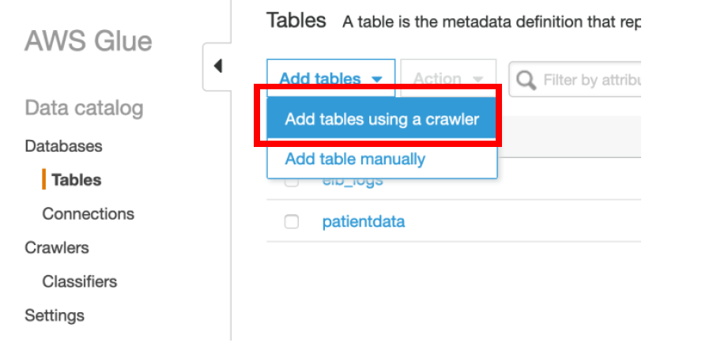

b) Specify the **crawler name** as **patient-dedup-data-cr**

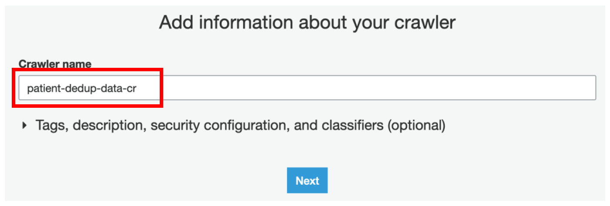

c) Select **Crawler source type** as **Data stores**

d) Choose **S3** as a data store and select the **transformresult** folder under **S3 bucket**

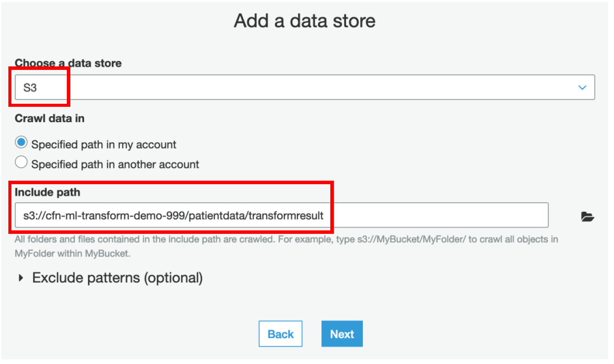

e) Choose **No** for **Add another data store**

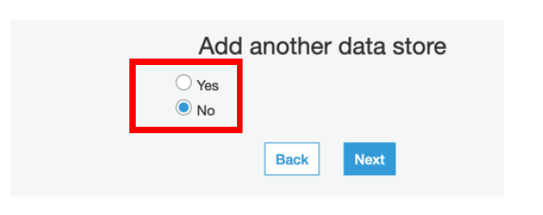

f) **Choose Existing IAM Role** from the drop down – **AWSGlueServiceRole-LF-MLLab**

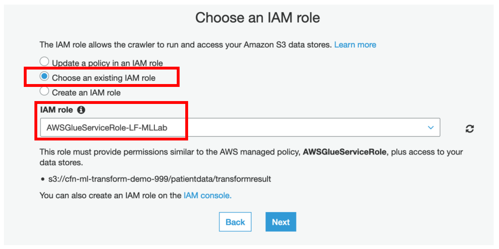

g) Select **Run on Demand**

h) Select **patientdb** as a **Database**

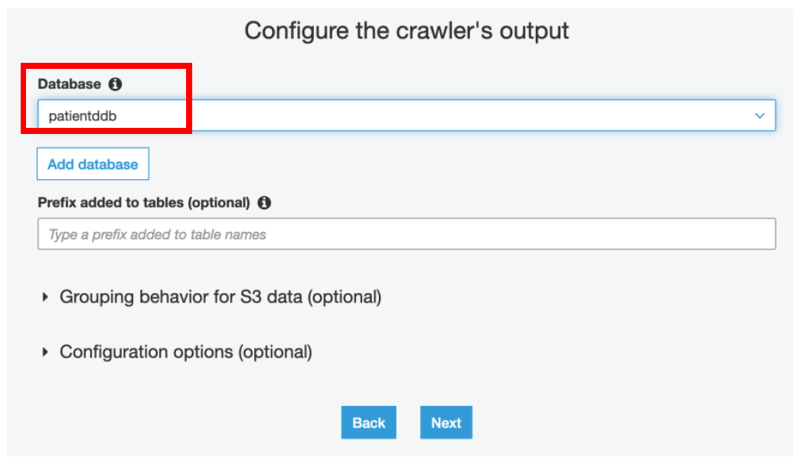

i) Review the information and click **Finish**

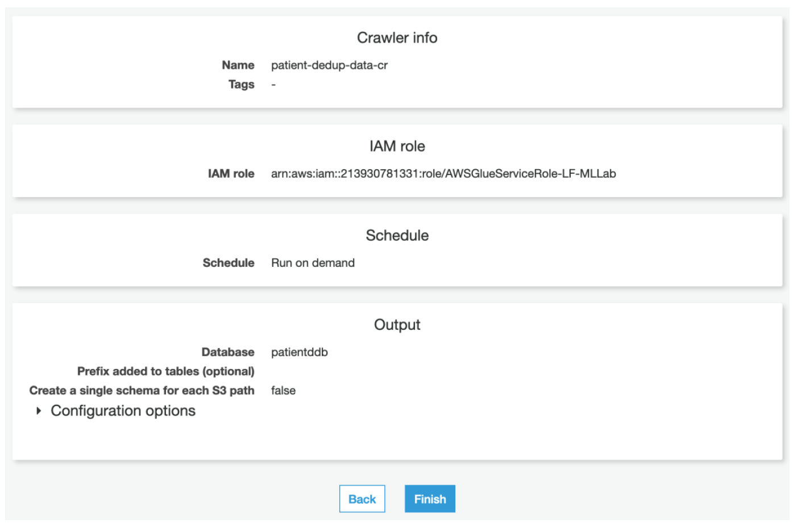

j) **Run** the crawler

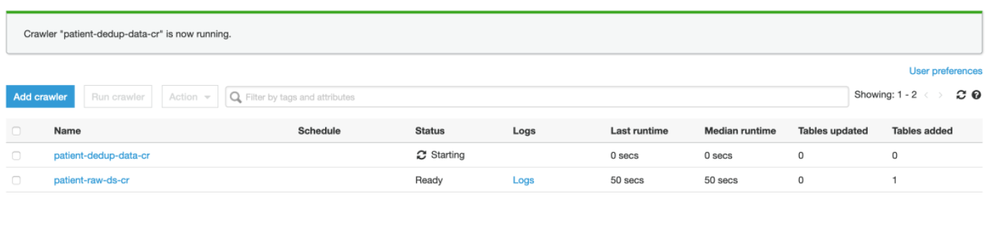

### Step 2: Login as Data Lake Administrator and grant dlanalyst permission to the table

a) Login as data lake administrator – **dladmin**

b) Navigate to **Lake Formation Console → select Data Permissions → Grant**

c) Grant user **dlanalyst** permission on **transformresult** table

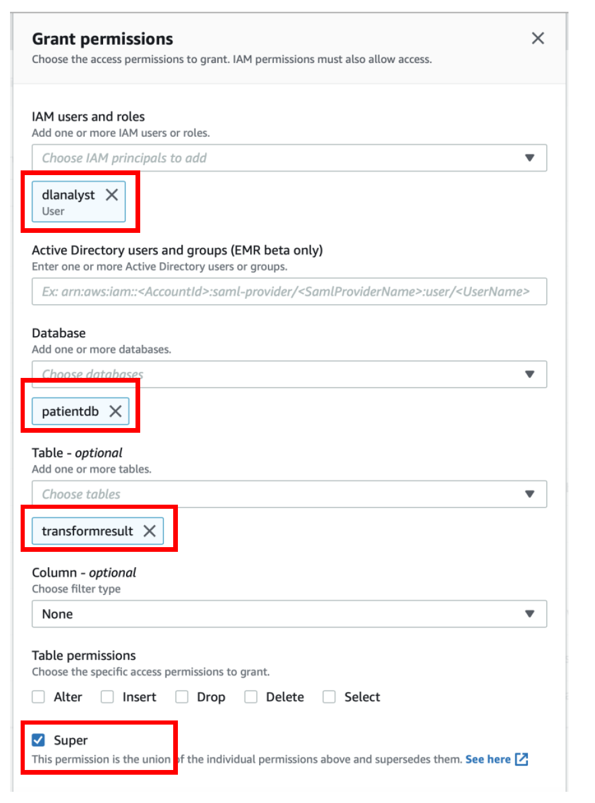

### Step 3: Modify Table Definition to remove quotes

a) Login as **dlanalyst**

b) Navigate to **AWS Glue Console → Databases → Tables** → Select the **transformresult** table and click on **Edit table details**

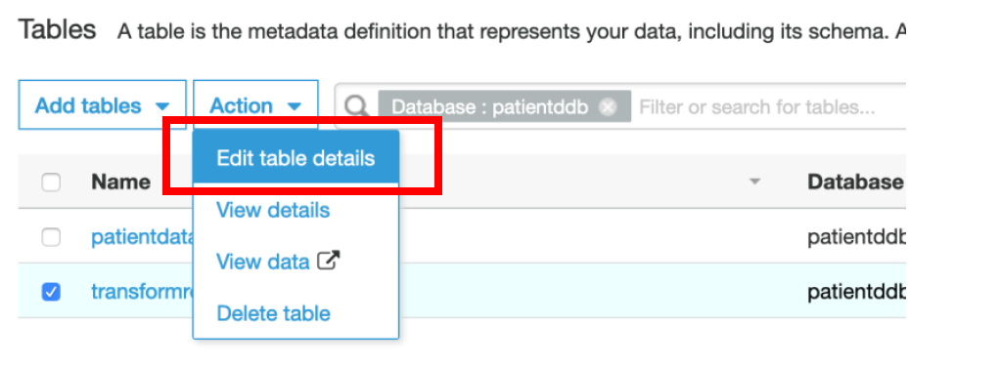

c) Change the **Serde Serialization lib** to **org.apache.hadoop.hive.serde2.OpenCSVSerde** and the **Serde Parameters** as shown below since the transformed result csv files contains the data values enclosed in double quotes **(“)**. You can set the Serde parameters as per your requirements based on the type of datasets you have. For our dataset, we will set below values

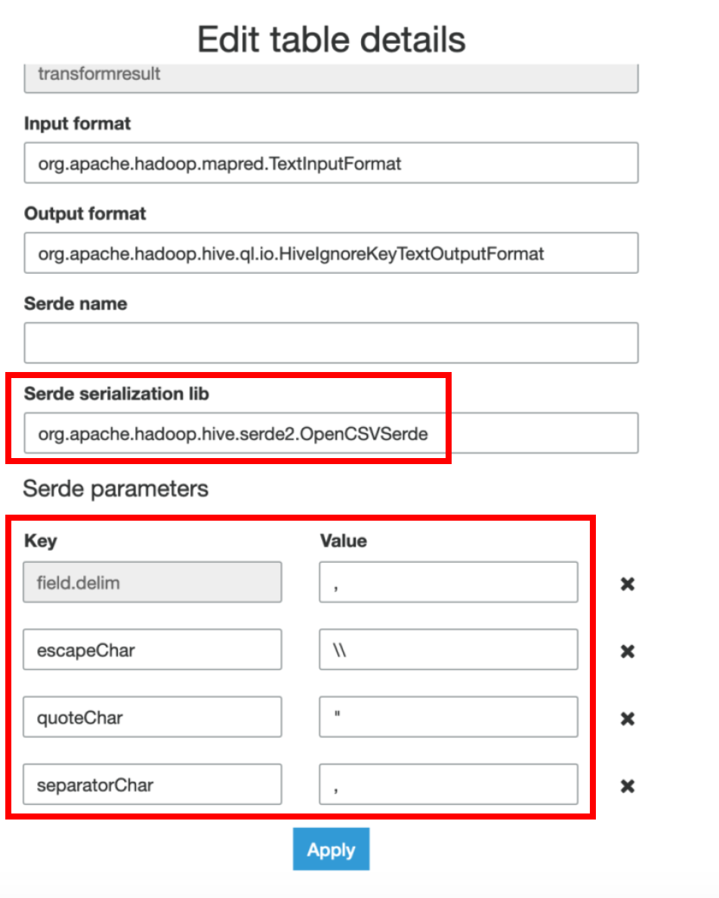

d) Click on the tablename **transformresult** and select **Edit schema**

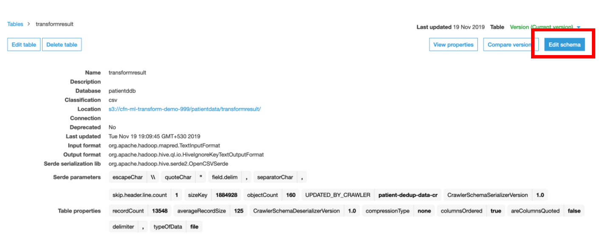

e) Edit the Schema of the table by setting the data types of **all** columns to **“String”**. You can choose to retain the inferred data types by Glue Crawler as per your requirements as well. For this case, we will set all to String datatype for the sake of simplicity **except match_id column** datatype set as **“bigint”**.

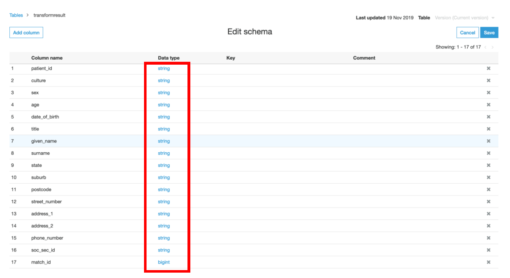

f) Select **View data** option which will take you to **Amazon Athena** to query the data from a data lake

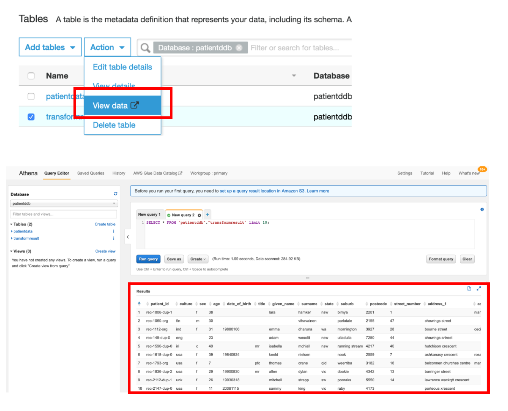

## Congratulations!! You have successfully completed the lab.

___

[Back to main guide](../README.md)
